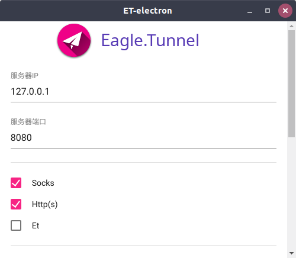
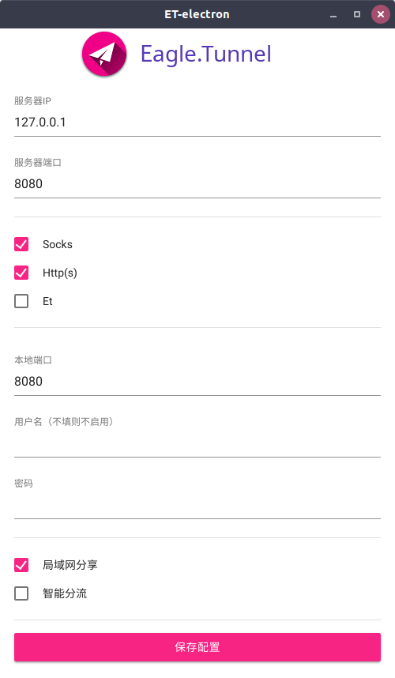
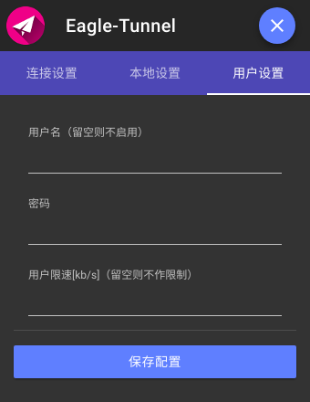
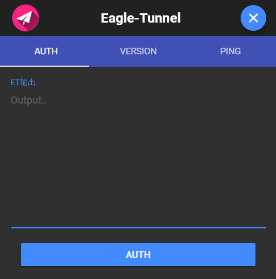

# ET-electron

 Eagle Tunnel with GUI for Linux, Windows and Mac

基于：[eagle.tunnel.go](https://github.com/eaglexiang/eagle.tunnel.go)开发

前端基于[MDUI](https://github.com/zdhxiong/mdui)

~~由两个只会写C++、对js基本0基础的学生用electron花了一天半编写~~

好吧到现在为止已经不止一天半了QwQ...

# 安装

请去Releases里下载自己系统对应的软件压缩包。

解压即可

现阶段支持的系统：

+ Linux 64/32 位
+ Windows 64/32 位
+ Mac 64 位

# 更新

请去Releases里下载最新版的软件压缩包

解压并覆盖原来的目录即可

配置将会被保存在[userData](https://electronjs.org/docs/api/app#appgetpathname)目录下的`et-electron/config`目录中，因此配置文件不会因为覆盖更新而丢失

# 使用

## 启动程序

+ Linux : 双击打开`et-electron`
+ Windows : 双击打开`et-electron.exe`
+ Mac : 双击打开`et-electron.app`

启动程序后程序将默认后台运行，您可以在系统托盘图标中找到它。

## 配置设置

点击托盘图标

在弹出来的菜单中选择“配置”。

配置界面将会弹出。

接着按您的服务器配置设置您的程序配置即可。

保存配置后连接会自动重启，无需断开重连

配置文件保存的路径：

* win: `%APPDATA\et-electron\config`
* linux: `~/.config/et-electron/config`
* mac: `~/Library/Application\ Support/et-electron/config`

## 连接/断开/重连服务器

点击托盘图标。

在弹出来的菜单中选择“操作 => 连接/断开/重连”即可。

重连操作仅当处于“连接”状态时有效，会断开您当前的链接并新建一个链接。

## 自动连接

点击托盘图标。

在弹出来的菜单中勾选“自动连接”，这样在下次程序启动时会自动根据您的配置连接服务器。

这样您就可以将ET-electron设为开机启动项后自动开启服务了。

Windows系统设置开机启动项可以用注册表添加

Linux系统设置开机启动项可以在首选项->启动应用程序中添加

Mac系统设置开机启动项可以在程序启动后，在dock里面选择'登录时打开'

## 测试服务(check)

这个功能可以用于测试et服务是否工作正常，或者更轻松地判断问题所在之处。

点击托盘图标。

在弹出来的菜单中单击“check”

用于调用内建的检查指令的图形化界面将会弹出。

在界面中你将会看到“AUTH,VERSION,PING”三个TAB分页。

单击“AUTH”按钮将会调用内建指令：`[et.go] check auth -c [client.conf]`

单击“VERSION”按钮将会调用内建指令：`[et.go] check version -c [client.conf]`

单击“PING”按钮将会调用内建指令：`[et.go] check ping -c [client.conf]`

调用指令的返回结果将会在界面中的“ET输出”文本框内实时显示。

## 自定义

这个功能使得用户可以自定义：

+ 代理域名列表(proxy list)
+ 直连域名列表(direct list)
+ hosts 文件

具体可以参见[ET 配置](https://github.com/eaglexiang/eagle.tunnel.go/blob/master/docs/config.md)

简单来说，您可以将自己常用的国内网站（如百度）添加进 direct list 中，而常用的国外网站（如谷歌）添加进 proxy list 中，以提升 et 在智能模式下对这些站点的**定位速度**。et 将会对访问的地址与列表中的内容进行**后缀匹配**，也就是说如果列表中有“google.com”，那么“translate.google.com”、“www.google.com”等都会被识别到。

（hosts 文件的作用就不做赘述了）

基本上所有的常用网站都已包含在 et 自带的 proxy list 与 direct list 中了，具体可以参见 [https://github.com/remmina/proxy-list](https://github.com/remmina/proxy-list)，若对自带列表有增加建议可在此项目中提交 pr。

请注意，自定义文件需要重连 et 才能生效，请在保存自定义文件后选择“操作 => 重连”使得修改生效。

## 查看程序及内核版本

点击托盘图标。

在弹出来的菜单中单击“关于”

弹出的信息框将显示程序的版本，并调用`[et.go] -v`命令实时显示et内核版本

# 截图

# 鸣谢

感谢[eaglexiang](https://github.com/eaglexiang/eagle.tunnel.go/commits?author=eaglexiang)大佬开发的[eagle.tunnel.go](https://github.com/eaglexiang/eagle.tunnel.go)项目，没有这个项目便没有ET-electron。~~这不是废话吗~~

感谢[electron项目](https://github.com/electron/electron)，没有这个项目作者便不会接触到js。

感谢[MDUI项目](https://github.com/zdhxiong/mdui)，提供了美观的前端框架以及详细的开发文档。
